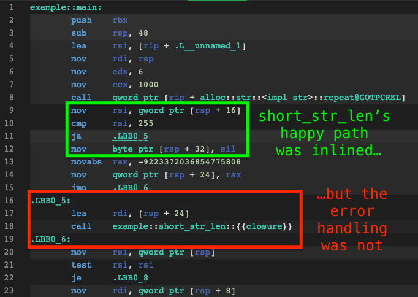
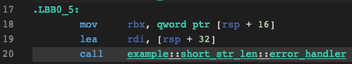

_What's cooler than being cool?_

# 🧊 Ice Code 🧊

_Alright alright alright alright alright alright alright alright_ 

## What is this?

`ice_code` provides the `ice!` macro, which labels a given block of Rust code as a
"cold path" in the application--one that is rarely executed. This information allows the
compiler to prioritize optimizing the other code paths, leading to better method inlining
behavior and boosting performance in the common case.

## Usage

### Source
Here's an example method that branches into two paths:
1. The common case, where the argument it receives is exactly what it's expecting.
2. The error handling branch, where the validation logic rejects the argument.

```rust
/// Returns the length of the provided string as long as it's shorter than 256 bytes.
fn short_str_len(input: &str) -> Result<u8, String> {
    if let Ok(short_len) = u8::try_from(input.len()) {
        // We expect this path to be taken almost every time
        Ok(short_len)
    } else { 
        // Oops, the string is too big. This path will almost never be executed.
        //
        // The `format!` call below requires a surprising amount of assembly to
        // heap-allocate a string, serialize its arguments, and panic if the
        // system is out of memory.
        // 
        // Let's mark the code that constructs a nicely formatted error as being
        // the cold path--ice code.
        ice! {
            Err(format!("Input string was {} bytes, which is too long.", input.len()))
        }
    }
}

pub fn main() {
    let result = short_str_len("foobar".repeat(1_000).as_str());
    assert!(result.is_err());
}
```

### Compiled output

As this godbolt.org output shows, the happy path's code got inlined into `main`
while all of the machinery needed to construct an error string has been pushed
somewhere else and is hidden behind a `call` instruction.
 


### Labeled cold code

If you use multiple `ice!` invocations in the same method, the mangled anonymous names produced
by the compiler may be difficult for humans to disambiguate. You can add a label to the generated
assembly by using this syntax:

```rust
cold! {
    // label          expression
    error_handler => Err(format!("..."))
}
```

This will produce assembly like the following:


